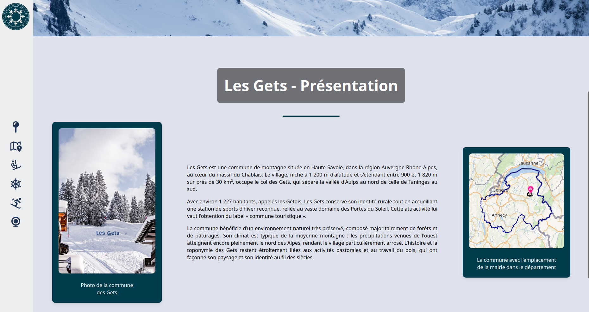
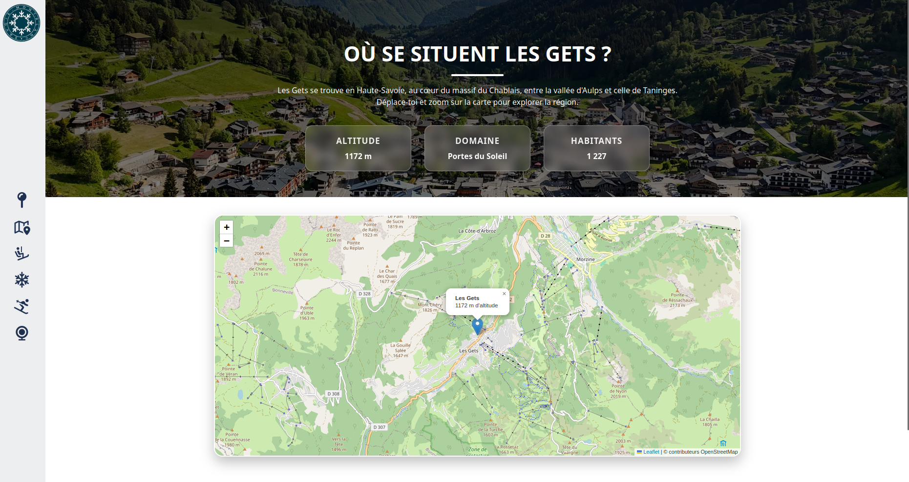
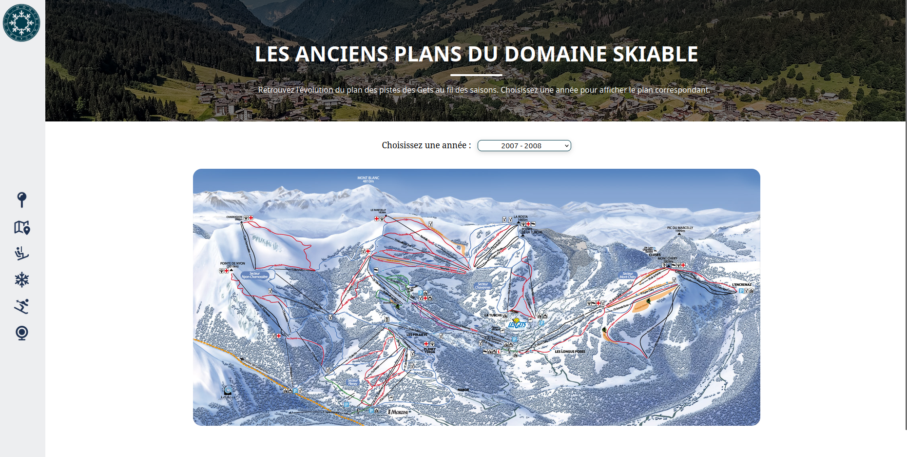
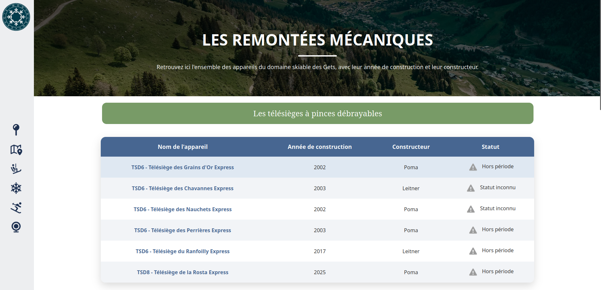
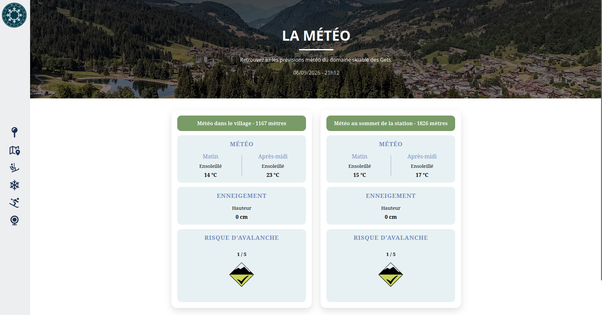
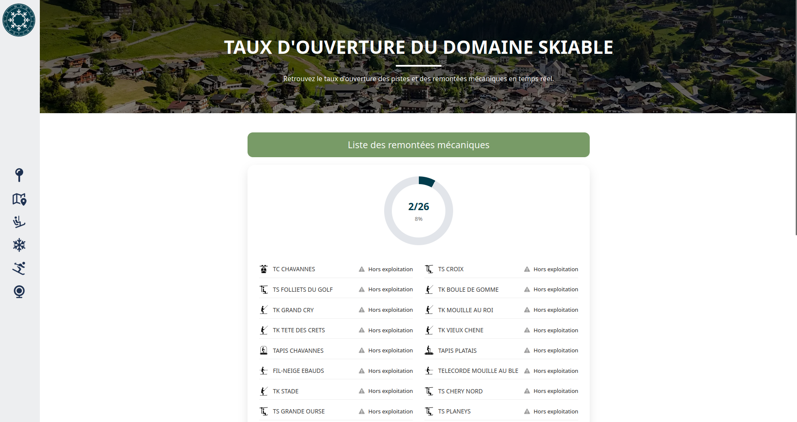
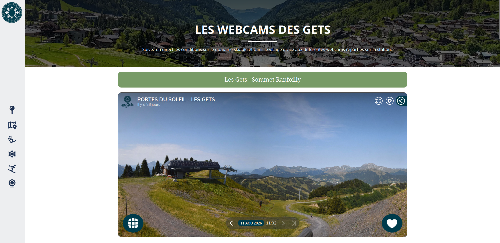

<!-- |-------------------------------------------------------------------------------------------| -->
<!-- |                                         LANGUAGE                                          | -->
<!-- |-------------------------------------------------------------------------------------------| -->
<div align="right">
  <a href="README.md">
    
  </a>
  <a href="README.en.md">
    
  </a>
</div>

<!-- |-------------------------------------------------------------------------------------------| -->
<!-- |                                          HEADER                                           | -->
<!-- |-------------------------------------------------------------------------------------------| -->
<h1 align="left">🏔️ Les Gets Website</h1>

<p align="justify">
Ce projet est un site web personnel dédié à la station de ski des Gets, en Haute-Savoie. Il présente la station à travers plusieurs pages : sa localisation géographique, l'historique de ses plans du domaine skiable, ses remontées mécaniques, la météo en temps réel, le taux d'ouverture du domaine, ainsi que ses webcams.
</p>

> **Ce projet est en cours de développement et n'est pas terminé.** De plus, certaines fonctionnalités reposent sur des API privées dont les identifiants ne sont pas inclus dans ce dépôt pour des raisons de confidentialité. Si vous clonez et testez le site, les pages météo et taux d'ouverture ne fonctionneront donc pas en conditions réelles. Des captures d'écran sont fournies pour illustrer le rendu attendu.

<!-- |-------------------------------------------------------------------------------------------| -->
<!-- |                                       À PROPOS                                            | -->
<!-- |-------------------------------------------------------------------------------------------| -->
## ❄️ À propos du projet

<p align="justify">
Le site est composé d'une page d'accueil présentant quelques photos et un court historique de la station, puis de six pages accessibles depuis un menu de navigation commun :
</p>

- **La localisation géographique** : présentation de la station à travers quelques informations clés telles que l'altitude, le domaine skiable et le nombre d'habitants, ainsi qu'une carte interactive de la région.
- **Les anciens plans du domaine skiable** : consultation des plans du domaine par année.
- **Les remontées mécaniques** : reportages détaillés sur les télésièges fixes et débrayables ainsi que les télécabines.
- **La météo** : température, hauteur de neige et risque d'avalanche au village et au sommet de la station via une API privée.
- **Le taux d'ouverture du domaine skiable** : état d'ouverture de chaque infrastructure via une API privée.
- **Les webcams** : consultation des webcams de la station.

<br>
<p align="justify">
La carte de la page géographie est réalisée avec la bibliothèque Leaflet. Le reste du site est développé en HTML, CSS et JavaScript.
</p>

| Technologie | Usage |
|:---:|---|
|  | Structure des pages web |
|  | Mise en forme et animations |
|  | Interactivité et appels aux API |
|  | Carte interactive de la page géographie |

<!-- |-------------------------------------------------------------------------------------------| -->
<!-- |                                        APERÇU                                             | -->
<!-- |-------------------------------------------------------------------------------------------| -->
## 📸 Aperçu

**Image de la page d'accueil :**
<div align="center">
  
</div>
<br>

**Image de la page géographie :**
<div align="center">
  
</div>
<br>

**Image de la page des anciens plans :**
<div align="center">
  
</div>
<br>

**Image de la page des remontées mécaniques :**
<div align="center">
  
</div>
<br>

**Image de la page météo :**
<div align="center">
  
</div>
<br>

**Image de la page taux d'ouverture du domaine :**
<div align="center">
  
</div>
<br>

**Image de la page webcams :**
<div align="center">
  
</div>
<br>

<!-- |-------------------------------------------------------------------------------------------| -->
<!-- |                                        UTILISATION                                        | -->
<!-- |-------------------------------------------------------------------------------------------| -->
## 🚀 Lancer le projet

<p align="justify">
Pour visualiser le site, il suffit d'ouvrir le fichier <code>index.html</code> dans un navigateur. Les pages géographie, plans, remontées mécaniques et webcams fonctionnent normalement. En revanche, les pages météo et taux d'ouverture du domaine ne pourront pas afficher de données réelles, les identifiants des API privées utilisées n'étant pas inclus dans ce dépôt.
</p>

<!-- |-------------------------------------------------------------------------------------------| -->
<!-- |                                    STRUCTURE DU PROJET                                    | -->
<!-- |-------------------------------------------------------------------------------------------| -->
## 📁 Structure du projet

```text
Les-gets-website/
├── css/                         # Feuilles de style
├── images/
│   ├── avalanche/               # Icônes et images liées au risque d'avalanche
│   ├── carte/                   
│   ├── icone/                   # Icônes du site 
│   ├── logo/                    # Logo du site
│   ├── paysage/                 # Photos de paysages de la station
│   ├── piste/                   # Icônes pour les pistes de ski
│   ├── plan/                    # Anciens plans du domaine skiable
│   ├── remontees/               # Images des remontées mécaniques
│   └── readme/                  # Images utilisées dans le README
├── js/                          # Scripts JavaScript
├── pages/
│   ├── remontees/               # Pages détaillées des remontées mécaniques
│   ├── geographie.html          # Page localisation géographique
│   ├── meteo.html               # Page météo
│   ├── ouvertureDomaine.html    # Page taux d'ouverture du domaine
│   ├── plan.html                # Page des anciens plans du domaine
│   └── webcam.html              # Page webcams
├── index.html                   # Page d'accueil
├── README.md                    # Documentation du projet
└── README.en.md                 # Documentation du projet en anglais

```

<!-- |-------------------------------------------------------------------------------------------| -->
<!-- |                                       À VENIR                                             | -->
<!-- |-------------------------------------------------------------------------------------------| -->
## 🛠️ Reste à faire

<p align="justify">
Le site est encore en cours de développement. Voici les principaux points restant à améliorer :
</p>

```
- Réaliser les reportages pour les téléskis.
- Mettre en place le responsive design pour que le site s'adapte aux tablettes et aux
téléphones.

- Migrer la gestion des remontées mécaniques vers PHP couplé à une base de données MySQL 
afin d'alléger le code HTML et de dynamiser l'affichage des tableaux.

- Trouver un moyen de sécuriser les mots de passe utilisés dans le JavaScript afin de pouvoir
rendre l'intégralité du code source disponible.

- Finir la page sur le taux d'ouverture du domaine skiable.
- Développer une page contact avec un formulaire envoyant un e-mail contenant le nom, le prénom
et les informations saisies.

- Améliorer le pied de page.

- Mettre à jour les pages consacrées aux remontées mécaniques afin de prendre en compte
les récentes suppressions et remplacements d'installations, notamment le télésiège de
la Pointe, le télésiège de la Grande Ourse et le télésiège des Grains d'Or.
```

<!-- |-------------------------------------------------------------------------------------------| -->
<!-- |                                       CONTRIBUTEURS                                       | -->
<!-- |-------------------------------------------------------------------------------------------| -->
## 👥 Contributeurs

Travail réalisé individuellement dans le cadre d'un projet personnel.

<div align="center">

[](https://github.com/rmax3iu)

</div>
